<!--
  PROFILE README  (username: rishi-ventrapragada)
  I pre-filled the parts I knew from our chats (name, location, college, focus).
  Anything still in {{double braces}} is for you to complete before committing —
  mainly contact links, your motto, and a few skill labels. Delete this comment when done.

  The banner at the top is your custom SVG. For it to show, the file
  life-os-banner.svg MUST be committed in the same repo (root folder).
-->

<!-- 1. BANNER — your custom Life OS SVG -->
<p align="center">
  
</p>

<!-- 2. PROFILE VIEWS -->
<p align="center">
  
</p>

<p align="center">
  <b>{{One-line tagline — e.g. "CS (Data Science) student who likes turning ideas into things that run."}}</b>
</p>

---

<!-- 3. ABOUT ME + 4. QUICK STATS -->
<table>
<tr>
<td valign="top" width="55%">

### About Me

```yaml
name: Rishi Ventrapragada
location: Hyderabad, India
institution: Vidya Jyothi Institute of Technology (VJIT)
role: CS (Data Science) Student & Developer

focus:
  - Data Science & Machine Learning
  - Full-stack development (Django)
  - DSA & problem solving

currently_learning:
  - Java & Object-Oriented Programming
  - Data Structures & Algorithms
  - Django

passion: "{{Your one-line motto.}}"
```

</td>
<td valign="top" width="45%">

### Quick Stats

🎓 CS (Data Science) @ VJIT, Hyderabad
💡 Data Science · Web Development
🛠️ Java · Python · Django · MySQL
🌱 Exploring ML & GDG projects
📫 {{Best way to reach you}}

</td>
</tr>
</table>

---

<!-- 5. TECH ARSENAL -->
<h3 align="center">Tech Arsenal</h3>

<p align="center"><b>Languages &amp; Frameworks</b></p>
<p align="center">
  
</p>

<p align="center"><b>Tools &amp; Platforms</b></p>
<p align="center">
  
</p>

<p align="center"><b>Highlighted Skills</b></p>
<p align="center">
  
  
  
</p>

---

<!-- 6. GITHUB ANALYTICS -->
<h3 align="center">GitHub Analytics</h3>

<p align="center">
  
  
</p>

<p align="center">
  
</p>

---

<!-- 7. CURRENT FOCUS -->
<h3 align="center">Current Focus</h3>

| 🎯 Academics | 🚀 Coding | 🧩 Building |
|:---:|:---:|:---:|
| Core CS subjects | DSA in Java | Django projects |
| Strong fundamentals | Daily practice | GDG @ VJIT |
| {{item}} | {{item}} | {{item}} |

---

<!-- 8. CONNECT -->
<h3 align="center">Let's Connect</h3>

<p align="center">
  <a href="https://linkedin.com/in/{{your-handle}}"></a>
  <a href="mailto:{{you@email.com}}"></a>
  <a href="https://x.com/{{your-handle}}"></a>
</p>

<p align="center"><i>"{{Closing quote or motto.}}"</i></p>
